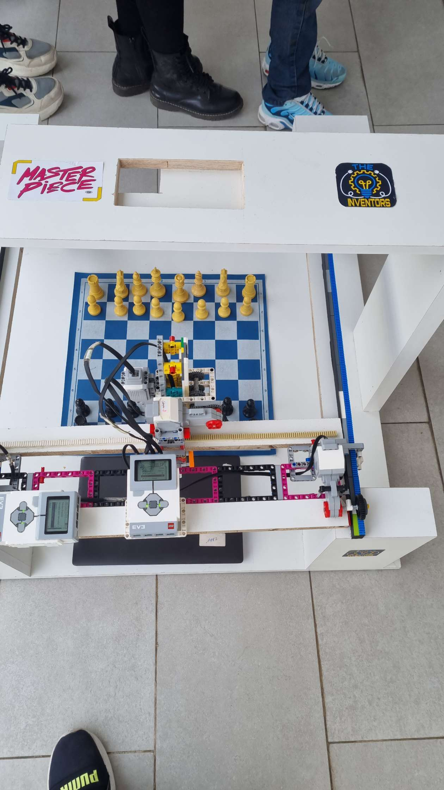
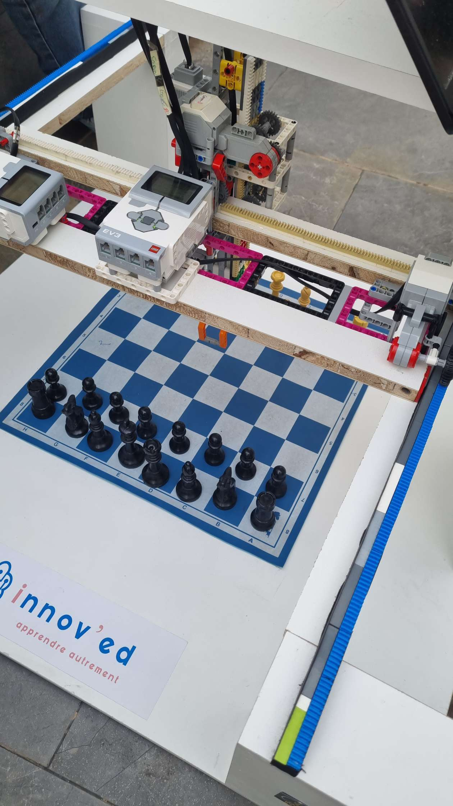
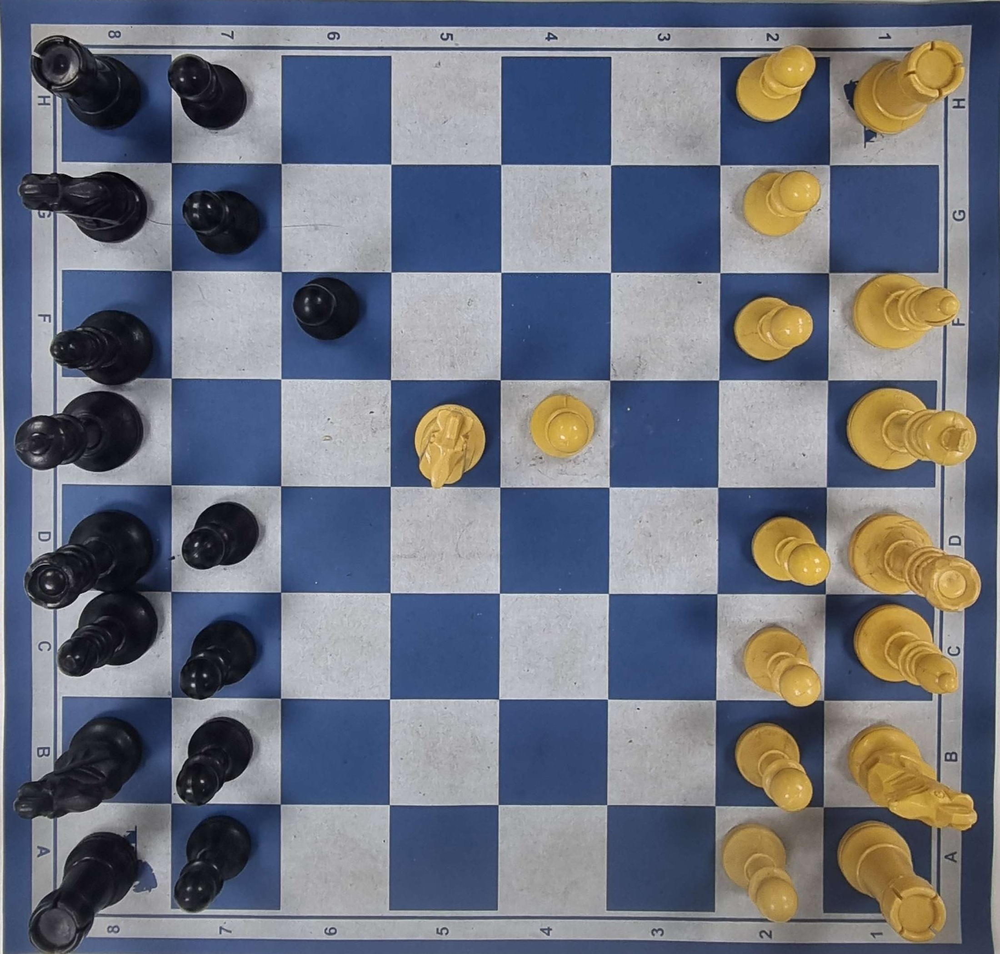
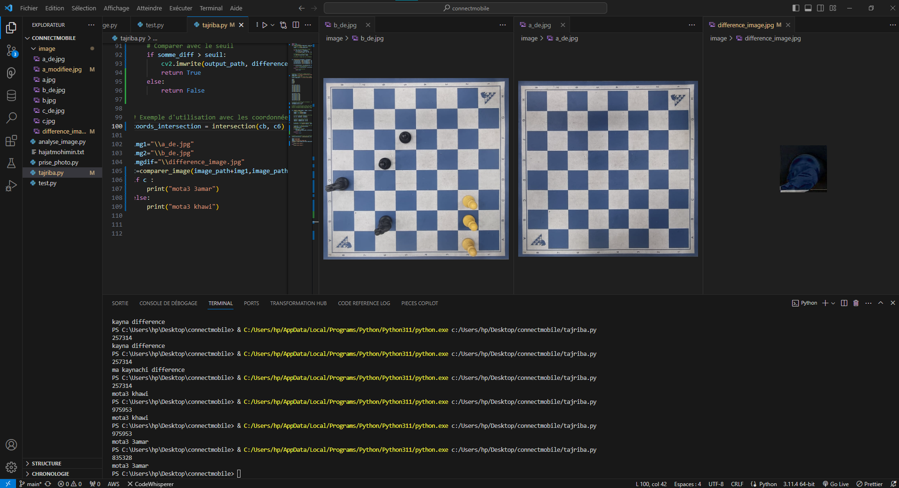

# Chess Machine

A robot that plays physical chess. Built for a FIRST Lego League competition in 2023–2024 — won the **Rising All Star Award**.

A phone camera photographs the board after each human move. A Python script detects what piece moved using computer vision, feeds the position to Stockfish, and sends the engine's reply to a LEGO EV3 arm that physically picks up and places the piece.

> This repository is a reconstruction. The project was built at 15, under competition pressure, with no version control — code was written fast and shared over Discord. The original files were recovered in 2026 from Discord chat exports and AI conversation logs. What you're reading is the recovered codebase, not the original one.

---

## How it worked

```
Phone (browser)
  │  Take Picture → HTTPS + Socket.IO → server_camera/server.js
  │                                      saves 0.jpg, 1.jpg, 2.jpg… to public/
  ▼
chess_bot/chess_bot.py   ← watchdog fires on each new .jpg
  │  bege_en_rouge()     replace beige pieces with red pixels
  │  presence_rouge()    count red pixels per square (>3000 = piece present)
  │  get_mvmnt()         diff two board states → UCI string e.g. "e2e4"
  │  chess.Board         validate and track game state
  │  Stockfish           calculate best reply e.g. "e7e5"
  │  http.server         write "take E7E5" or "kill E7E5" to mvm.txt, serve on port 80
  ▼
ev3/main.py   ← runs on the EV3 brick
  │  urllib polls http://<PC_hotspot_IP>:80 every second
  │  reads "take E7E5" or "kill E7E5"
  │  take() / kill()     3-axis arm executes the move
  ▼
Physical board
```

**Vision:** no ML. The pieces had a distinctive beige color under the build's lighting. The script replaced that color with red and counted red pixels per square — more than 3000 means a piece is there. Diffing two consecutive board states gives the move. It worked.

**PC ↔ EV3 link:** Bluetooth was tried first and failed (ev3dev's Python 2.7 doesn't support the Bluetooth module). The solution was a WiFi hotspot on the PC — the EV3 connected to it and polled a plain `http.server` file every second with `urllib`, which is built-in and needs no pip. No external dependencies on the brick.

**Motor names** (`talla3`, `yhabbet`, `xod`, `fta7lyed`) are Moroccan Darija — the project's working language.

---

## Codebase

```
chess-machine/
├── chess_bot/chess_bot.py                # PC side (see diagram above)
├── server_camera/                        # Phone-facing camera relay
│   ├── server.js
│   ├── index.html
│   └── public/                           # Drop folder for captured images (gitignored)
├── ev3/main.py                           # EV3 side (see diagram above)
├── vision/chessboard_mvmnt_detection.py  # Same vision logic as a standalone class
├── assets/111.png                        # Calibration reference photo (loaded as INITIAL_IMAGE)
├── media/                                # Real build photos/video, April–May 2024
└── archive/                              # Early January 2024 prototypes
```

**Motor wiring:**

| Port | Function |
|------|----------|
| A | X-axis (column A–H), 241°/unit |
| B | Gripper — `xod` closes, `fta7lyed` opens |
| C | Y-axis (rank 1–8), 200°/unit |
| D | Z-axis — `talla3` raises, `yhabbet` lowers, 1.3 rotations |

---

## Limitations

These are as-shipped — not bugs introduced by reconstruction:

- **En passant fails silently.** `get_mvmnt()` diffs two board states and expects exactly two changed squares (one emptied, one filled). En passant changes three squares. The function returns `None` and the move is dropped.
- **Black castling not detected.** Only white kingside and queenside are hardcoded. Black castling changes four squares and hits the same two-square limit.
- **Capture patch (`stk`).** When Stockfish captures, the captured piece's square is patched to `False` in the next diff so it doesn't appear as a phantom empty square. This workaround works for normal captures but breaks down in the same edge cases above.
- **Calibration is build-specific.** The crop region (`870, 1480, 1250×1230`), beige color (`[72, 155, 194]` ± 50), pixel threshold (3000), and motor tables (`x{}`, `y{}`) were tuned to the original physical setup. A rebuild would need re-calibration.
- **Stockfish binary not included.** It was too large and platform-specific to track.

---

## Media

Photos, video, and one dev screenshot from the original build.


*The full setup at the FIRST Lego League event in Tangier — built in Tétouan, team "The Inventors". "Master Piece" on the sign is the FLL season theme, not the project name. Two EV3 bricks and the gantry sit above the board.*


*The X/Y gantry and gripper directly over the board, mid-build.*


*The image loaded as `INITIAL_IMAGE` in `chess_bot.py` — used to calibrate square positions and the beige-piece color threshold. It's a test capture, not a standard starting position.*


*January 2024 — an early version of the movement-diff logic (`tajriba.py`) running in VS Code, comparing two board photos to isolate the moved square.*


*May 1, 2024 — the gripper picking up a piece during a live run.*

---

## Stack

- **Vision:** OpenCV
- **Engine:** Stockfish via `python-chess`
- **Camera relay:** Node.js + Express + Socket.IO (HTTPS)
- **PC→EV3:** Python `http.server` + `urllib` polling
- **EV3:** ev3dev, Python 2.7, `ev3dev2` motor library
- **File watching:** `watchdog`
